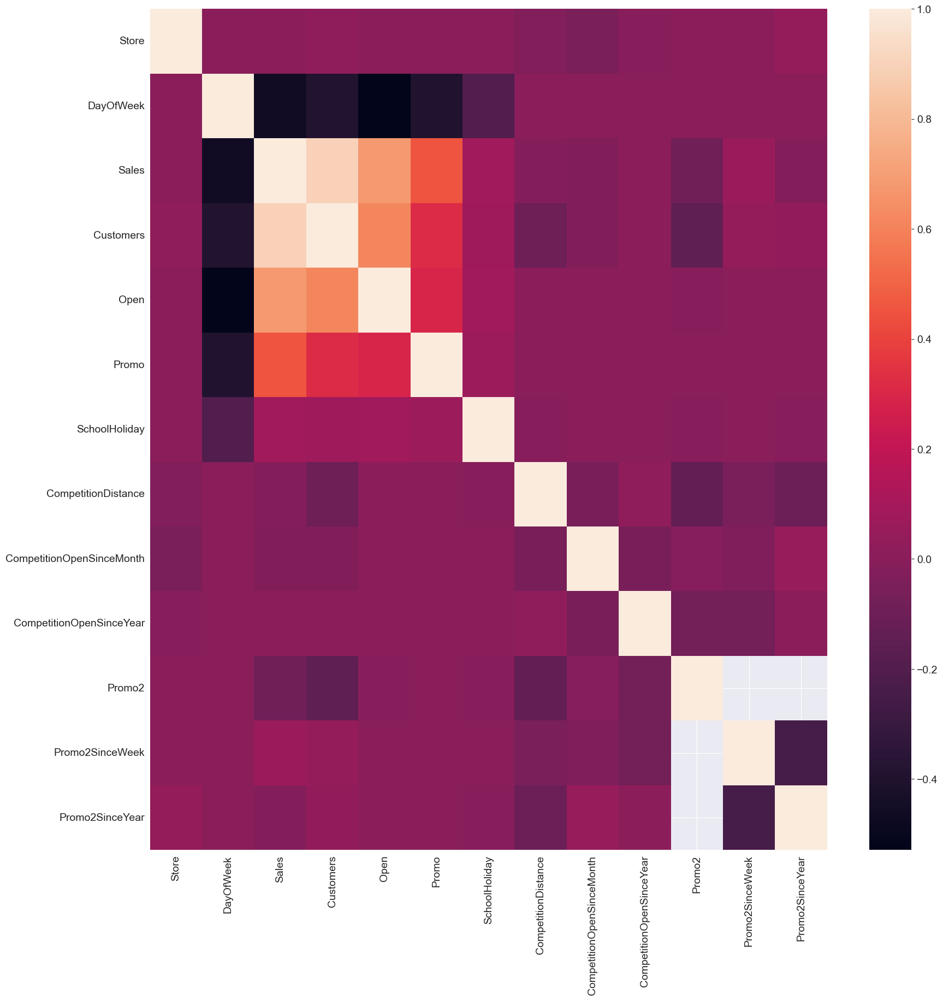
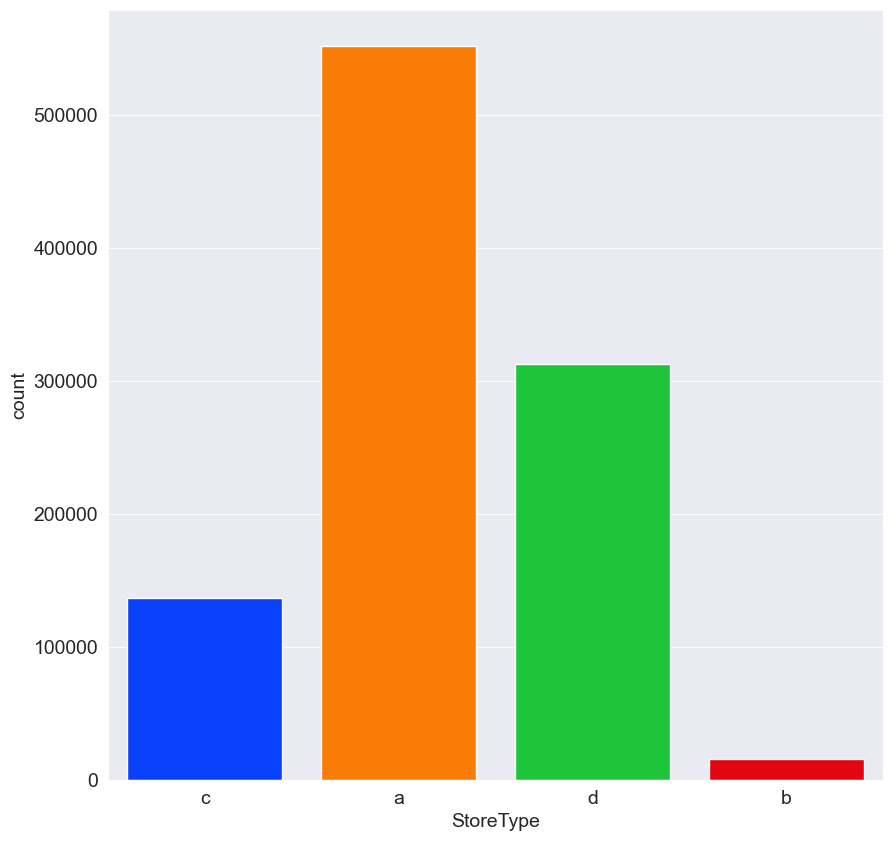
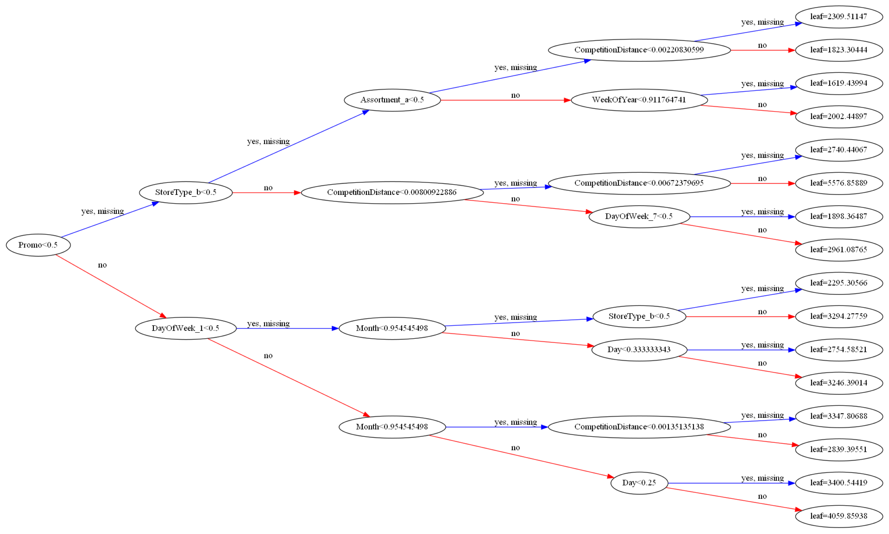
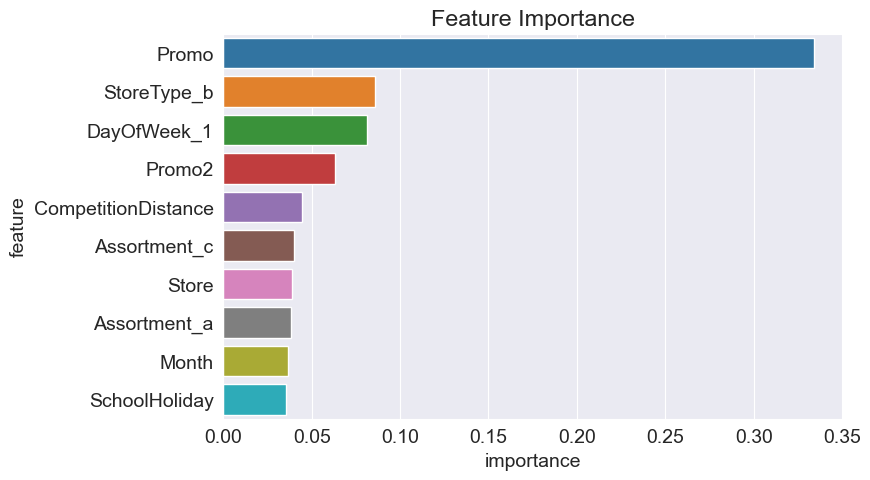
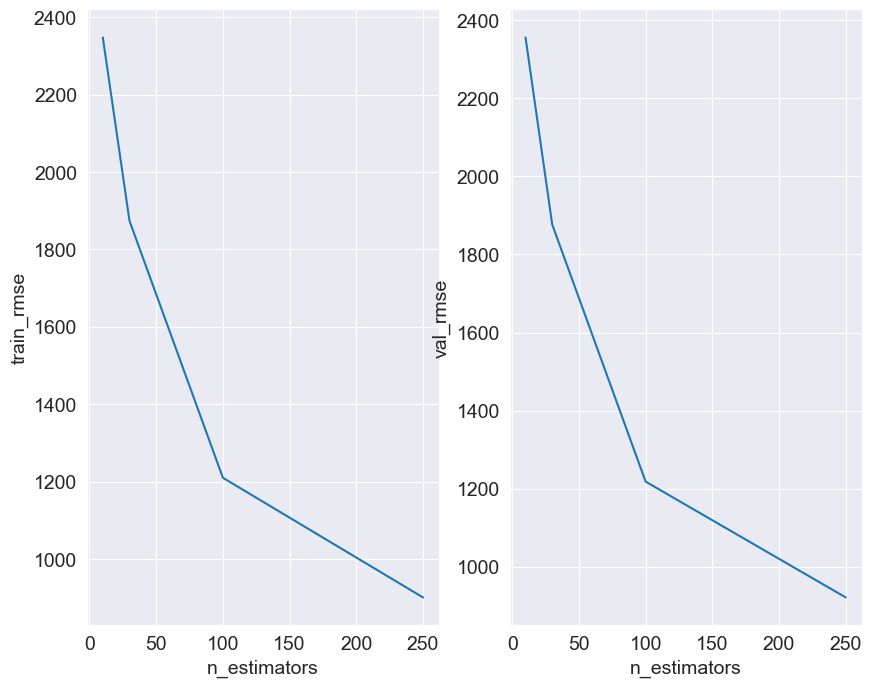
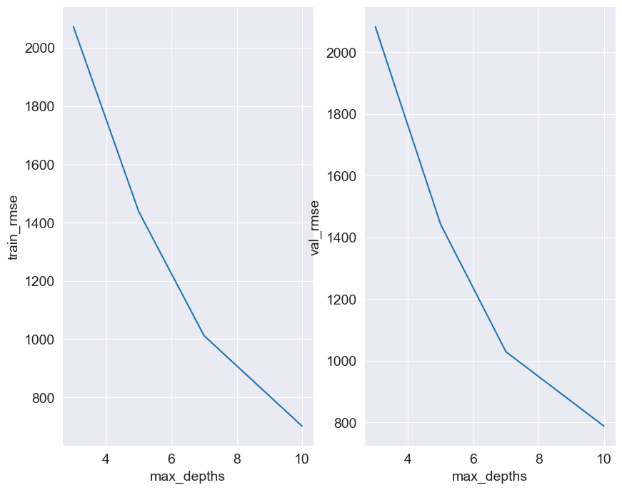

## Rossman Stores Sales Prediction using XGBoost
### Overview
* Created a model that predicts the sales of the rossman stores (with mean average precision of 0.13 ~ kaggle score) located in thousands of different places.
* Data was obtained from kaggle competition of the Rossman Store Sales with an objective to dive deep into the theoretical and practical concepts of XGBoost.
* Engineered features from the dates given to quantify the age of the store and the time since the competition of the store is open.
* Hyperparamter Tuning of XGBoost was performed to get the best parameters possible.

### Resources:
**Python:** 3.9.16
**Packages:** XGBoost, Numpy, Pandas, Matplotlib, Seaborn, Opendatasets, GraphViz, LightGBM, Scikit-learn, Plotly
**Installing for webframe rqeuirements:** pip install -r requirements.txt
**K-Fold Cross Validation Function:** https://machinelearningmastery.com/how-to-configure-k-fold-cross-validation/

### Data Cleaning and Feature Engineering:
* Combined the store dataframe to train dataframe.
* Made different columns for individual information of dates to get the age of the store and competitions around the store.
* Created columns to calculate how long has the store promoted different Promos and how often do they promote them.
* Parsed competition distance data to maximum of the distance to not let model confuse that distance 0 means competition is near.

### EDA:
Different techniques were used for data exploration. Few are outlined below: \
* Correlation Heatmap on the whole merged dataframe.

* Countplot of the types of stores.

### Model Building:
* After splitting the training data to inputs and targets, and handling the missing information, the numerical training data was scaled where as the categorical data was encoded using One Hot Encoding.
* XGBoost model was used and hyperparameter tuning was performed with different values.
* GridSearchCV was also implemented with little to no progress in a time span of hours, thus individual tests with the hyperparameters were conducted.
* A sample of the XGBoost tree is below:

* Feature Importances from the trees were also calculated and plotted:

* K-Fold cross validation technique was also used to train and evaluate the model.
* Hyperparameter tuning was implemented and plotted. Some of the plots are as follows:
 

### Model Performance:
* The submission file was updated with the values returned by the model that predicted all the test data.
* Kaggle score was 0.13 with the best score being 0.10.

### Future work:
* Productionizing of the model can help other businesses collect data and use the model as is.

